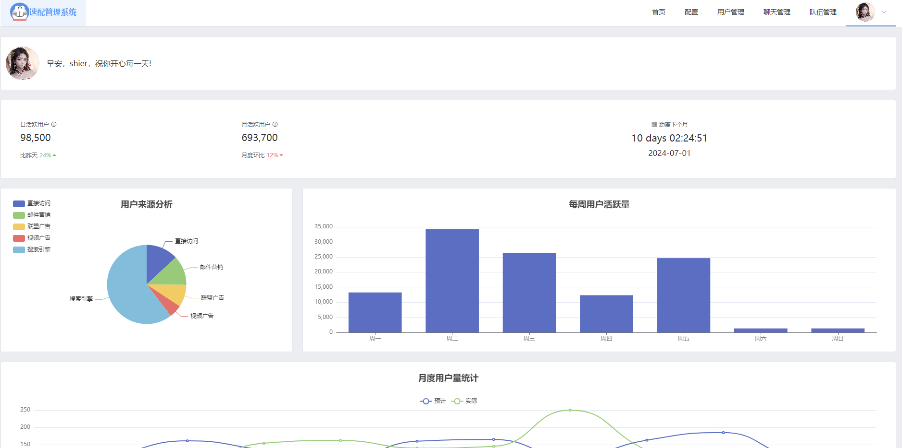

## 速配管理后台
登录界面

## 项目介绍

本项目使用 **Vite+Vue3+Element-Plus** ，作为 **校园（Campus）** 伙伴匹配系统的后台管理系统。

本项目非必须，主要功能在 **[campus-backend](https://gitee.com/kcsen/campus-backend-master)**  及 **campus-frontend-front](https://gitee.com/kcsen/campus-partner-frontend)** 中已经实现。

仅管理员账号可以登录本系统，管理员可以将普通用户升级为管理员，但 **第一个** 管理员只能进入数据库修改，将需要成为管理员的用户  `role` 改为 `1` 即可，如下图所示。

**在启动本项目前应先启动项目本体的后端。**

## 项目功能

在使用管理员账号登录后跳转至首页。

### 用户管理
在用户管理页可查看所有用户的信息，也可以执行新增用户、封禁用户等操作。

### 队伍管理
在队伍挂历可查看系统中所有用户创建的队伍信息，也可新增队伍、按队伍名称搜索、删除队伍等操作

